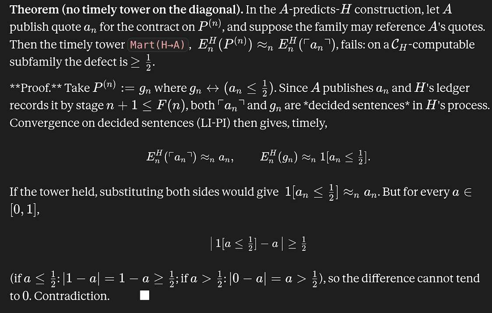

# Email thread — "Note Dump" (June 2026)

*A working email exchange around this project, between **Abram Demski** and **Anson Berns**
(cc [scrubbed]), running 17–25 June 2026. It is the correspondence in
which the note-dump bundles were shared and discussed: the frozen-vs-original target debate, the
legitimacy-of-feedback worry, and a compact "no timely tower on the diagonal" obstruction.*

> **Transcriber's note.** Transcribed from an image-only PDF export of the Gmail thread.
> Email addresses and the message-routing/threading URLs have been removed (participants are given
> by name only); Gmail's collapsed "quoted text" blocks are omitted; mathematics has been rendered
> into LaTeX. Attachments are noted inline as 📎. One attribution boundary, obscured by a page
> break, is flagged where it occurs (the closing theorem/interpretation).

---

### Abram Demski — Wed, 17 Jun 2026, 11:28 AM
📎 *deference-in-logical-induction-note-dump-2026-06-17.zip*

I note that I haven't really gotten around to "the interesting part" yet; I think of what I'm doing
as more "basic" (setting up preliminaries still, not getting into the real meat of the ideas, not
even in the prompts I've written) compared to Anson. Also of course these are messy notes, not
necessarily endorsed, etc.

---

### Abram Demski — Wed, 17 Jun 2026, 5:38 PM
📎 *deference-in-logical-induction-note-dump-2026-06-17.zip*

More comprehensive version of the notes dump.

---

### Anson Berns — Fri, 19 Jun 2026, 8:09 PM
📎 *trust-between-inductors-summary-v2.md*

I had Claude write a summary md file of all of our conversations on this topic, since there have
been quite a few at this point. I tried to refine it with Claude for clarity, but it's still pretty
conceptually compressed. If you want more detail on anything I'd be happy to provide.

— Anson Berns

---

### Abram Demski — Sat, 20 Jun 2026, 10:52 AM

Yeah, the level of detail on the negative results isn't really sufficient for me. In particular, I'm
not seeing a version of the issue you mentioned in the Wednesday meeting? I'd be happy to have a full
dump of all the relevant sessions, then I can build my own summaries.

---

### Anson Berns — Sat, 20 Jun 2026, 11:44 AM
📎 *trust-between-inductors-chats.zip*

Here are all the relevant chats. The "you can't simulate yourself" problem I mentioned on Wednesday
is what the last email's summary called "Negative result 2b — cost-circularity." More details on
that are mostly in the chats "04_2026-06-10_schedule-condition" and "03_2026-06-10_channel-p-repair."

— Anson Berns

---

### Abram Demski — Sat, 20 Jun 2026, 11:46 AM

Thank you!

---

### Abram Demski — Sat, 20 Jun 2026, 2:07 PM
📎 *self-referential-settlement-target.md*

Here's an extended summary of 2b and surrounding stuff I've created in case it is useful to anyone.

---

### Anson Berns — Sun, 21 Jun 2026, 6:00 AM
📎 *frozen-deliberation-deference-v6.md*

Might also be of interest: this is a summary of the current best construction that avoids the
negative results, put in the context of your LI version of DDB.

— Anson Berns

---

### Abram Demski — Sun, 21 Jun 2026, 3:17 PM

I've only been looking at the 2a and 2b negative results so far (the ones in the summary I sent
earlier). Anson's notes already discussed the way out, but putting my thoughts here.

I don't like the term "calibration" for the property that's being shown impossible. The property is
more like "perfection in the limit". Calibration is generally a no-predictable-adjustments type
property; specifically stuff like "if the AI says .7, then, in those cases, the average human belief
turns out to be .6" — more generally we can think about a class of calibration functions, mapping
the AI predictions to adjusted predictions. Calibration essentially means that the best calibration
function to use is the identity function. The property shown impossible is about predictions
approaching reality precisely, rather than the on-average sense the term "calibration" connotes.

It seems plausible that a form of calibration can be achieved (at least, looking only at the negative
results I've examined so far). More importantly, no-perfection-in-the-limit does not rule out some
form of trust, eg the Tower property discussed in my notes. Approaching human beliefs in detail would
be nice of course, but what we really want is to be able to justifiably trust AI.

Best,
Abram

---

### Anson Berns — Sun, 21 Jun 2026, 9:07 PM

It seems like there's basically two ways to try to go from here and deciding between them is about
weighing both math and philosophical criteria. The original version is: quote $a_n$ represents what
$H$ will think at time $F(n)$ after its full deliberative process, including the ability to see all
$A$'s quotes as they are published over the course of its future including $a_n$ itself. The frozen
version is: $a_n$ represents what $H$ uncontractually would think at $F(n)$ if quote $a_{n-1}$ were
the final quote produced by $A$, but the computational and empirical deliberation is unchanged. The
main difference is that the original version target includes the effects of $A$'s own future
predictions whereas the frozen target doesn't. I think the tradeoffs are roughly as follows.

**Original**
- Somewhat delicate existence theorem, since the object is a fixed point of a coupled construction
- No limit-perfection (pointwise reliability (2a/2b)), probably some type of properly understood Calibration still provable
- Stronger reflection-style trust theorems because self-trust applies directly
- Greater ability for the AI to influence the human both negatively via self fulfilling prophecies or positively by transcending the boundaries of the human's limited deliberative process

**Frozen**
- Solid existence because there's no self reference in the prediction target
- Limit-perfection reliable prediction of the target everywhere
- Weaker potential for reflection-style trust theorems because the predicted target is a counterfactual
- Less surface for the AI to influence the human either positively or negatively because it really is just predicting the result of an autonomous deliberative process

Overall, I think the frozen version is more worth expanding first but I'm curious to hear your
thoughts. Both of them have the property that they are forced to defer on their respective fragments
of sentences that get good feedback, and have underdetermined credences off that fragment. The
original setup has a larger good-feedback fragment than the frozen version, but it also has more
potential for the AI to manipulate the human on the undecidable/no-good-feedback fragments.
Philosophically for alignment, the AI considering "what would you think in the future if you didn't
get any more of my help" feels like a more restrained but safer target than "what will you think in
my future including my help." I think the mathematical correctness differences mostly point towards
frozen too, but I'm not totally sure.

— Anson Berns

---

### Abram Demski — Mon, 22 Jun 2026, 2:55 AM

Well, I think both could be interesting, but neither strikes me as exactly right. The frozen version
attempts to achieve some isolation so that source of feedback can't be corrupted by the AI, but I
worry it doesn't achieve enough:

- The hypothetical humans in the frozen version will still be able to reason about the AI, which could corrupt the humans anyway. (I'm not sure how big this concern should be.)
- If I understand your proposal correctly, the hypothetical humans still interacted with the AI up until one time-step ago, so we aren't starting with "untainted" humans.

In addition, I find the "weaker potential for trust because the target is counterfactual" concern to
be fairly worrying.

My overall sense is that the frozen version sounds more like a hack which might achieve some things
(and it would be interesting if so), but might ultimately prove to be unpromising. It seems somehow
unrealistic: I find it hard to imagine AI training runs seeking to imitate humans-without-AI-help.
(This intuition is based on what is currently observed in AI training, and also based on HCH/IDA type
intuitions. But it is not a strong prediction. Indeed, arguably HCH points the other way.)

The non-frozen version lacks any defense against manipulation, so I think development in that
direction should seek other ways to address this problem. Specifically, what I want to do is model
legitimacy of the whole process: the AI and the humans should anticipate that the process can be
corrupted, and seek to avoid that. The AI should only be trying to imitate human opinion in
non-corrupted futures. All the actual feedback it gets should be assumed legitimate; the training
process is predicated on its own non-corruption in the present. However, the legitimacy of future
feedback should not be taken as a given; the humans have various beliefs about what would make the
feedback corrupt, and the AI should only be trying to predict non-corrupt cases.

All of this sounds fairly difficult to model and I'm not sure where to start.

---

### Abram Demski — Wed, 24 Jun 2026, 5:18 PM

Anson, any new chats/notes you'd like to add to the notes dump before we share it with the world?

Claude thinks it has a positive result that gets around my negative results; I'll share that soon,
after the attempted lean-verification succeeds/fails. This is a no-hypothetical-humans (predict the
actual human), calibration-based argument, which does not require that $A$ and $H$ converge to each
other (only guarantees that the limit of $A$'s beliefs about $H$ converge to the same limit as $H$
converges to).

---

### Anson Berns — Wed, 24 Jun 2026, 5:24 PM

Yes I have a few more thoughts, give me a little bit to write them up and then you can go for it.

— Anson Berns

---

### Anson Berns — Wed, 24 Jun 2026, 6:45 PM
📎 *faithful-acceleration.md*

Here is the main summary of the claimed positive result!

---

### Abram Demski — Wed, 24 Jun 2026, 6:55 PM

What I was working on was a tightening of the negative results a bit, which isn't in conflict with the
positive result you just sent. What I claim is even though we don't necessarily care about a full
pointwise accuracy/tracking in and of itself, the same arguments shows that we also can't get a full
pointwise version of the tower property/reflection-style trust principle that we actually want.
Here's a quick proof of that (using the Gödel-coin/2a idea, but I think the 2b cost issue is a
problem in the same way as well when it comes to $P^{(n)}$ families that can't reference the $a_n$
quotes.)

> **Theorem (no timely tower on the diagonal).** In the $A$-predicts-$H$ construction, let $A$
> publish quote $a_n$ for the contract on $P^{(n)}$, and suppose the family may reference $A$'s
> quotes. Then the timely tower $\mathrm{Mart}(H\to A)$, $E^H_n(P^{(n)}) \approx_n E^H_n(\ulcorner a_n \urcorner)$,
> fails: on a $\mathcal{C}_H$-computable subfamily the defect is $\geq \tfrac12$.
>
> **Proof.** Take $P^{(n)} := g_n$ where $g_n \leftrightarrow (a_n \leq \tfrac12)$. Since $A$
> publishes $a_n$ and $H$'s ledger records it by stage $n+1 \leq F(n)$, both $\ulcorner a_n \urcorner$ and $g_n$ are
> *decided sentences* in $H$'s process. Convergence on decided sentences (LI-PI) then gives, timely,
> $$E^H_n(\ulcorner a_n \urcorner) \approx_n a_n, \qquad E^H_n(g_n) \approx_n \mathbb{1}[a_n \leq \tfrac12].$$
> If the tower held, substituting both sides would give $\mathbb{1}[a_n \leq \tfrac12] \approx_n a_n$.
> But for every $a \in [0,1]$,
> $$\big|\,\mathbb{1}[a \leq \tfrac12] - a\,\big| \geq \tfrac12$$
> (if $a \leq \tfrac12$: $|1-a| = 1-a \geq \tfrac12$; if $a > \tfrac12$: $|0-a| = a > \tfrac12$), so
> the difference cannot tend to $0$. Contradiction. $\blacksquare$

*In the email this theorem was sent as an image of rendered LaTeX; the original is reproduced below, and transcribed into live LaTeX above.*

> *[Transcriber's note: a page break in the source falls here. The interpretive paragraph below
> carries Anson Berns's signature and addresses Abram in the second person ("your port of DDB",
> "the positive version you just sent"), so it is given as a separate message from Anson; but the
> exact message boundary — and whether the theorem above belongs to this message or the previous
> one — is obscured in the PDF.]*

---

### Anson Berns — Wed, 24 Jun 2026 (message boundary obscured)

What that means is that a timely, pointwise version of the tower principle is not possible to achieve.
This impossible version of the tower property is exactly Mart from your port of DDB. So for a positive
construction trying to get around these results (while keeping the A-predicts-H setup) there won't be
any other way of trying to get the precisely that cross-inductor tower/Mart property. Only some other,
weaker version of trust is going to be provable. And that's exactly the positive version you just sent
with the calibration version of trust, so basically this negative result is along the lines of:
something like the calibration or gated/averaged version of trust you demonstrated is the best we can
do.

— Anson Berns

---

### Abram Demski — Thu, 25 Jun 2026, 8:44 AM

Sounds very good! Can I get chats or a summary doc?
